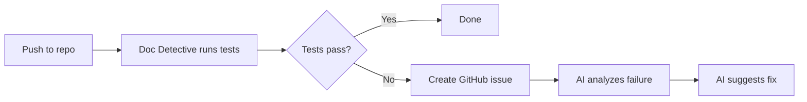

Set up a documentation system that detects failures, diagnoses problems, and suggests fixes automatically. Combine Doc Detective's GitHub Action with AI integrations to create a feedback loop: tests run on every push, failures trigger AI analysis, and the AI proposes repairs.

## How self-healing works

The self-healing pattern connects three components:

1. **Automated testing**: Doc Detective runs on every push or pull request, catching documentation that no longer matches your product.
2. **Failure detection**: When tests fail, the GitHub Action creates an issue with structured test results.
3. **AI diagnosis**: The issue mentions an AI integration that analyzes the failure and suggests fixes.



This creates a low-effort repair cycle. When documentation drifts from reality, the system surfaces the problem and provides actionable guidance.

## Set up self-healing

Configure your workflow to create issues with AI integration when tests fail:

```yaml
name: doc-detective
on: [pull_request]

jobs:
  runTests:
    runs-on: ubuntu-latest
    permissions:
      contents: read
      issues: write
    steps:
      - uses: actions/checkout@v4
      - uses: doc-detective/github-action@v1
        with:
          input: ./docs
          create_issue_on_fail: true
          integrations: claude
          prompt: |
            Analyze these Doc Detective test failures. For each failure:
            1. Identify the root cause (documentation drift, broken link, UI change, etc.)
            2. Suggest a specific fix with the exact text or code changes needed
            3. Flag if the issue requires product changes vs documentation changes
```

This configuration:
- Runs tests against the `./docs` directory
- Creates a GitHub issue when any test fails
- Mentions Claude in the issue with a detailed diagnostic prompt
- Passes the test results to Claude for analysis

## Craft effective prompts

The `prompt` input determines how AI integrations analyze failures. A good prompt produces actionable suggestions rather than generic advice.

### Prompt structure

Build your prompt around three elements:

| Element | Purpose | Example |
|---------|---------|---------|
| **Context** | Tell the AI what kind of documentation this is | "These tests validate API documentation for a REST service." |
| **Task** | Define what analysis you want | "Identify why each test failed and whether the fix belongs in docs or code." |
| **Format** | Specify how to structure the response | "For each failure, provide the file path, line number, and suggested edit." |

### Example prompts

**For API documentation:**

```yaml
prompt: |
  These tests validate API documentation. For each failure:
  - Check if the API endpoint, request format, or response changed
  - Provide the corrected curl command or code example
  - Note if this suggests an undocumented API change
```

**For procedural documentation:**

```yaml
prompt: |
  These tests validate step-by-step procedures. For each failure:
  - Identify which step broke and why
  - Check if the UI, command output, or workflow changed
  - Suggest updated instructions with exact wording
```

**For screenshot tests:**

```yaml
prompt: |
  These visual regression tests compare screenshots against baselines. For each failure:
  - Describe what changed visually
  - Assess if this is a cosmetic change, feature change, or bug
  - Recommend whether to update the baseline or report a product issue
```

### Prompt variables

Use these variables in your prompt or issue body:

| Variable | Expands to |
|----------|------------|
| `$RESULTS` | Full test results as a JSON code block |
| `$RUN_URL` | URL of the GitHub Actions workflow run |
| `$PROMPT` | The prompt text (useful in custom `issue_body` templates) |

## Choose an AI integration

Each integration behaves differently. Choose based on your workflow:

| Integration | Best for | Setup required |
|-------------|----------|----------------|
| `claude` | Deep analysis of complex failures | Install Claude GitHub app |
| `copilot` | Quick triage within GitHub | Enable Copilot for your repo |
| `promptless` | Automated documentation PRs | Connect repo to Promptless |
| `cursor` | Developer-focused code suggestions | Install Cursor GitHub app |
| `dosu` | Issue management and tracking | Install Dosu app |

Combine integrations to get multiple perspectives:

```yaml
integrations: claude,copilot
```

## Advanced configuration

### Custom issue templates

Override the default issue body to structure how results appear:

```yaml
issue_body: |
  ## Test Failure Report
  
  **Workflow run:** $RUN_URL
  
  ### Test Results
  $RESULTS
  
  ### Analysis Request
  $PROMPT
```

### Scheduled healing runs

Run tests on a schedule to catch drift before it reaches production:

```yaml
on:
  schedule:
    - cron: '0 6 * * *'  # Daily at 6 AM UTC
  push:
    branches: [main]
```

### Auto-assign for triage

Route issues to specific team members:

```yaml
issue_assignees: docs-team-lead,qa-engineer
issue_labels: doc-detective,needs-triage,automated
```

## Example: Complete self-healing workflow

This workflow combines scheduled runs, AI diagnosis, and automatic PR creation:

```yaml
name: doc-detective-self-healing
on:
  schedule:
    - cron: '0 6 * * 1'  # Weekly on Monday
  workflow_dispatch:  # Allow manual triggers

jobs:
  test-and-heal:
    runs-on: ubuntu-latest
    permissions:
      contents: write
      pull-requests: write
      issues: write
    
    steps:
      - uses: actions/checkout@v4
      
      - uses: doc-detective/github-action@v1
        with:
          input: ./docs
          create_issue_on_fail: true
          create_pr_on_change: true
          integrations: claude,promptless
          prompt: |
            Analyze these documentation test failures and provide:
            1. Root cause for each failure
            2. Specific text changes to fix the documentation
            3. Whether any failures indicate product bugs vs doc bugs
            
            Format your response as a checklist the docs team can work through.
          
          issue_title: "Weekly docs health check: failures detected"
          issue_labels: doc-detective,automated,weekly-check
          
          pr_title: "Doc Detective: Updated screenshots and outputs"
          pr_labels: doc-detective,automated,for-review
```

This workflow:
- Runs weekly to catch gradual documentation drift
- Creates issues with Claude and Promptless analysis when tests fail
- Automatically opens PRs when tests update screenshots or command outputs
- Labels everything for easy filtering and triage
