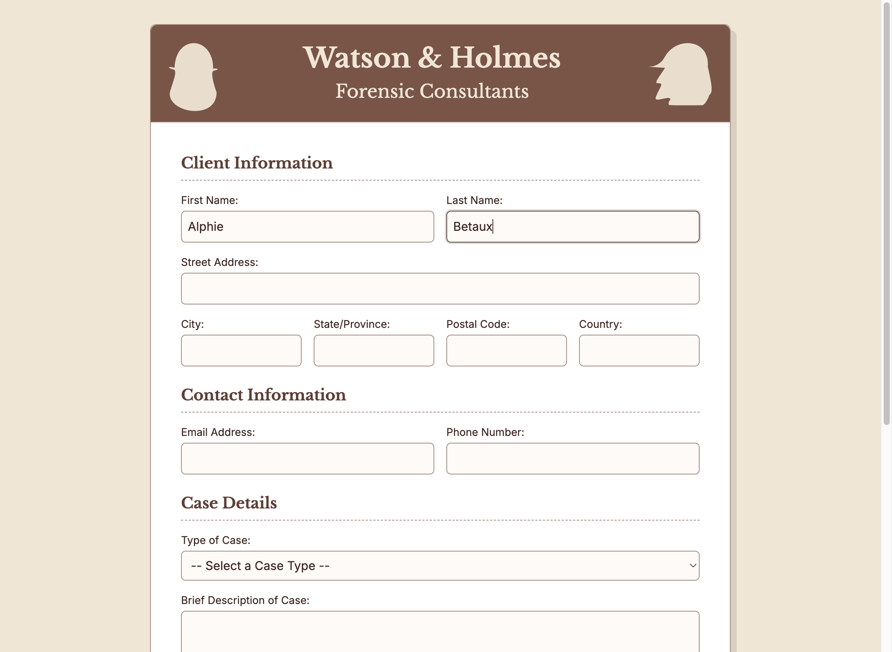

A common task in procedures involves filling in the fields of a form. This short test opens a sample input form for the Watson and Holmes Forensic Consulting agency and fills in just the first and last name.

To run the test:

1. [Set up your test environment](./set-up-your-test-environment).
2. In a terminal window, navigate to the `TestExamples` directory.

   ```shell
   cd TestExamples
   ```

3. Start your local server:

    ```shell
    live-server
    ```

3. Run the _form-filler1.json_ test spec with Doc Detective:

    <Tabs>
      <Tab title="NPX" language="npx">

    ```shell
    npx doc-detective -i form-filler1.json
    ```

      </Tab>
      <Tab title="Docker" language="docker">

    ```shell
    docker run -v .:/app docdetective/docdetective -i /app/form-filler1.json
    ```

    <Note>
    The `-v` argument mounts your current directory (`.`) to `/app` in the container.
    </Note>

      </Tab>
    </Tabs>



## Code walkthrough

```json
{
    "tests": [
        {
```

The first part of the test specification describes the execution environment (what platform and browser the test should run on). You can specify your own platform, but it doesn't hurt to make the script compatible with other platforms, as well.

```json
            "runOn": [
                {
                    "platforms": [
                        "windows",
                        "mac",
                        "linux"
                    ],
```

The Chrome browser is the only browser that currently supports the record feature, which will be used in later examples.

```json
                    "browsers": {
                        "name": "chrome",
```

When you run the test in the _headless_ state, the test runs without displaying the actions in a browser window. Setting this to false lets you watch the actions in your test.

```json
                        "headless": false,
```

The form in this example is too large to fit on the screen. The window and viewport can be set to the full size, even if it isn't displayed at this time. This is important for taking screenshots, which this tutorial covers.

```json
                        "viewport": {
                            "width": 1180,
                            "height": 1480
                        }
                    }
                }
            ],
```

Having set up the run environment, you can define the action steps for the test. First, open the form in a web browser.

```json
            "steps": [
                {
                    "description": "Go to the specified URL",
                    "goTo": "http://localhost:8080/watson_and_holmes_intake_form.html"
                },
```

Locate an element with the label "First Name:" and type in the value _Alphie_.

```json
                {
                    "description": "Type in the First Name",
                    "find": {
                        "elementText": "First Name:",
                        "click": true,
                        "type": "Alphie"
                    }
                },
```

Locate an element with the label "Last Name:" and type in the value _Betaux_.

```json
                {
                    "description": "Type in the Last Name",
                    "find": {
                        "elementText": "Last Name:",
                        "click": true,
                        "type": "Betaux"
                    }
                },
```

Pause 10 seconds, allowing you to see the results, then end the test. In real tests, you want to avoid long pauses to let tests run as quickly as possible, but pauses are invaluable when you're learning or debugging.

```json
                {
                    "description": "Pause long enough to show the changes.",
                    "wait": 10000
                }
            ]
        }
    ]
}
```

## Complete code sample

```json
{
    "tests": [
        {
            "runOn": [
                {
                    "platforms": [
                        "windows",
                        "mac",
                        "linux"
                    ],
                    "browsers": {
                        "name": "chrome",
                        "headless": false,
                        "viewport": {
                            "width": 1180,
                            "height": 1480
                        }
                    }
                }
            ],
            "steps": [
                {
                    "description": "Go to the specified URL",
                    "goTo": "http://localhost:8080/watson_and_holmes_intake_form.html"
                },
                {
                    "description": "Type in the First Name",
                    "find": {
                        "elementText": "First Name:",
                        "click": true,
                        "type": "Alphie"
                    }
                },
                {
                    "description": "Type in the Last Name",
                    "find": {
                        "elementText": "Last Name:",
                        "click": true,
                        "type": "Betaux"
                    }
                },
                {
                    "description": "Capture a screenshot of the completed form.",
                    "screenshot": "./output/form-filled-1-first-and-last-name.png"
                },
                {
                    "description": "Pause long enough to show the changes.",
                    "wait": 10000
                }
            ]
        }
    ]
}
```
Next Step: [Capturing a screenshot](./capture-screenshot).
