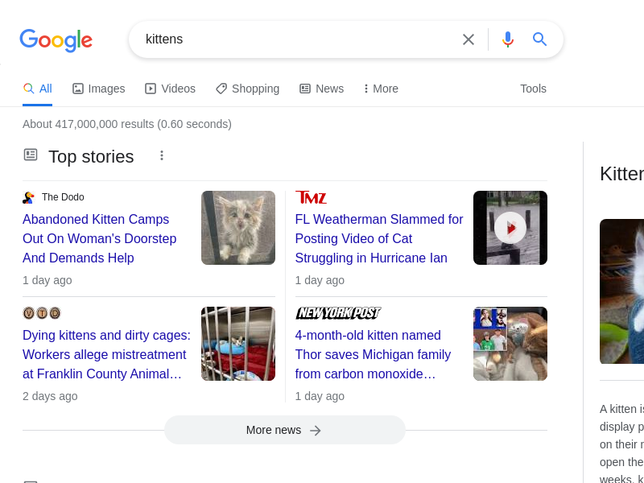

# Search for kittens

To use Google Search to find information on kittens,

1.  Open [Google Search](https://www.google.com).

    [comment]: # (test {"testId":"process-search-kittens", "action":"startRecording", "filename":"results.gif", "gifOptions": {"fps":15, "width":300}})
    [comment]: # (test {"testId":"process-search-kittens", "action":"goTo", "uri":"www.google.com"})

2.  In the search bar, enter "kittens", then press Enter.

    [comment]: # (test {"testId":"process-search-kittens", "action":"moveMouse", "css":"#gbqfbb", "alignH": "center", "alignV": "center"})
    [comment]: # (test {"testId":"process-search-kittens", "action":"wait", "duration":"5000"})
    [comment]: # (test {"testId":"process-search-kittens", "action":"moveMouse", "css":"[title=Search]", "alignV": "center"})
    [comment]: # (test {"testId":"process-search-kittens", "action":"type", "css":"[title=Search]", "keys":"kittens", "trailingSpecialKey":"Enter"})
    [comment]: # (test {"testId":"process-search-kittens", "action":"wait", "duration":"5000"})
    [comment]: # (test {"testId":"process-search-kittens", "action":"scroll", "y": 300})
    [comment]: # (test {"testId":"process-search-kittens", "action":"stopRecording"})
    [comment]: # (test {"testId":"process-search-kittens", "action":"screenshot", "filename":"results.png"})

Search results appear on the page.

## Recommended results

To go directly to a recommended result for your search, use the **I'm Feeling Lucky** button. If you're searching for american shorthair information,

[comment]: # (test {"testId":"text-match-lucky", "action":"goTo", "uri":"www.google.com"})
[comment]: # (test {"testId":"text-match-lucky", "action":"matchText", "css":"#gbqfbb", "text":"I'm Feeling Lucky"})

1.  Open [Google Search](https://www.google.com).

    [comment]: # (test {"testId":"process-lucky-shorthair", "action":"goTo", "uri":"www.google.com"})

2.  In the search bar, enter "american shorthair cats".

    [comment]: # (test {"testId":"process-lucky-shorthair", "action":"type", "css":"[title=Search]", "keys":"american shorthair cats"})

3.  Click **I'm Feeling Lucky**.

    [comment]: # (test {"testId":"process-lucky-shorthair", "action":"click", "css":"#gbqfbb"})