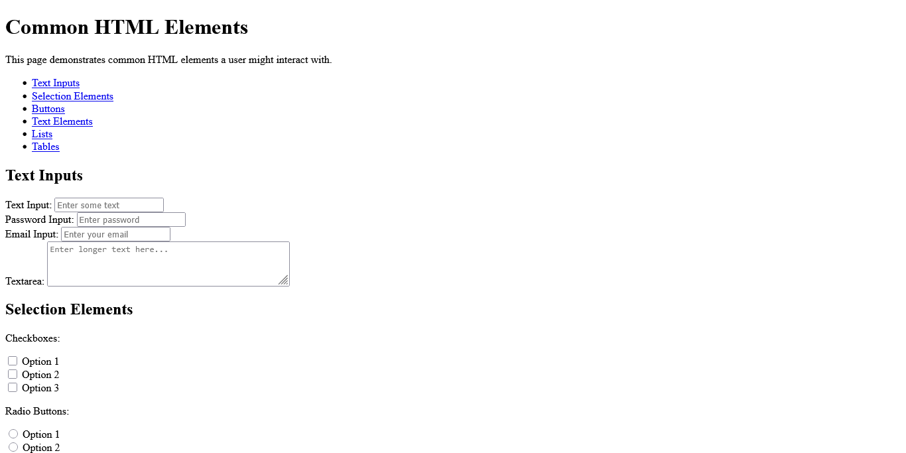

# Doc Detective documentation overview

<!-- test
testId: doc-detective-docs
detectSteps: false
-->

[Doc Detective documentation](http://localhost:8092) is split into a few key sections:

<!-- step checkLink: "http://localhost:8092" -->

- The landing page discusses what Doc Detective is, what it does, and who might find it useful.
- [Get started](http://localhost:8092) covers how to quickly get up and running with Doc Detective.

  <!-- step checkLink: "http://localhost:8092" -->

Some pages also have unique headings. If you open [the demo page](http://localhost:8092) it has **Text Elements**.

<!-- step goTo: "http://localhost:8092" -->
<!-- step find: Text Elements -->

{ .screenshot }
<!-- step screenshot: reference.png -->
